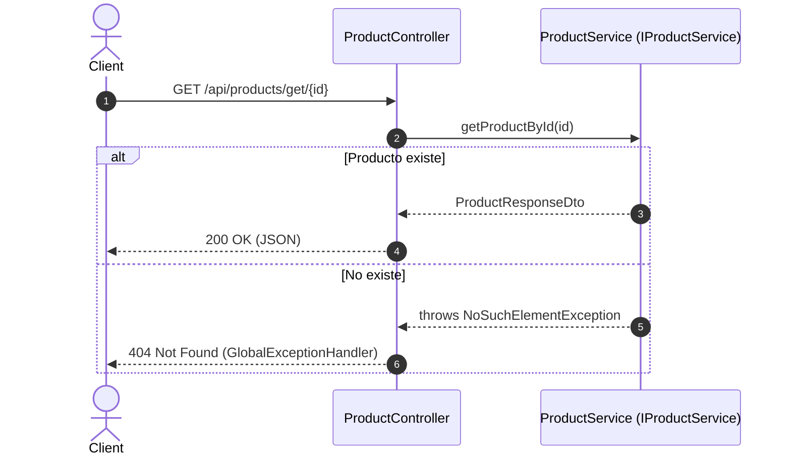
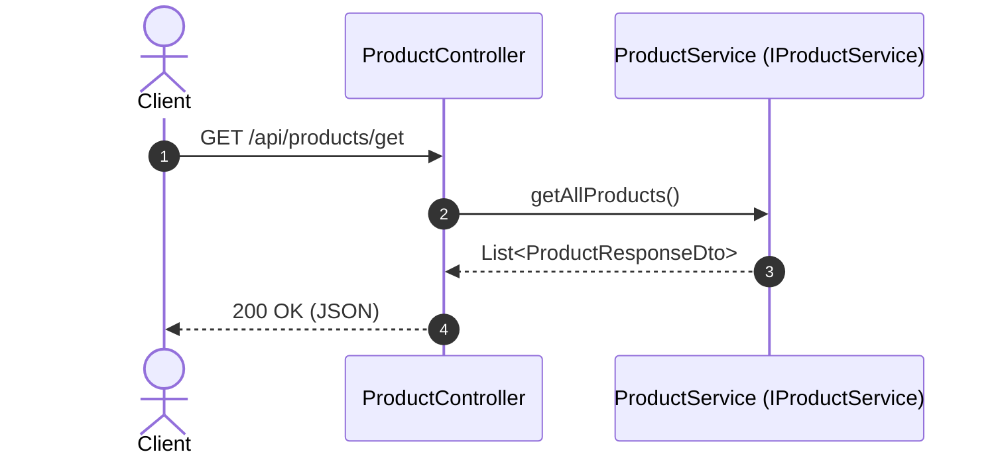
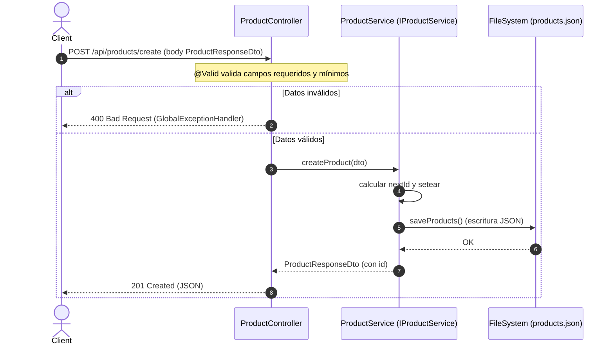
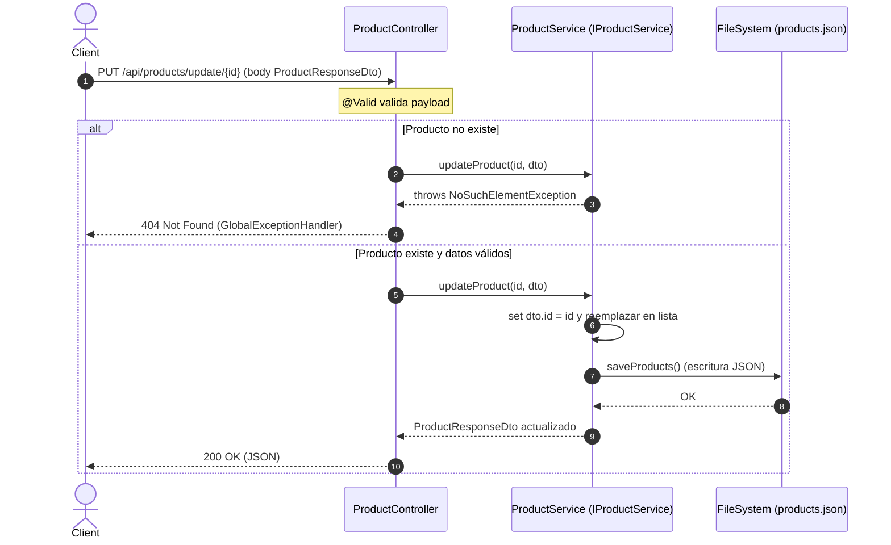
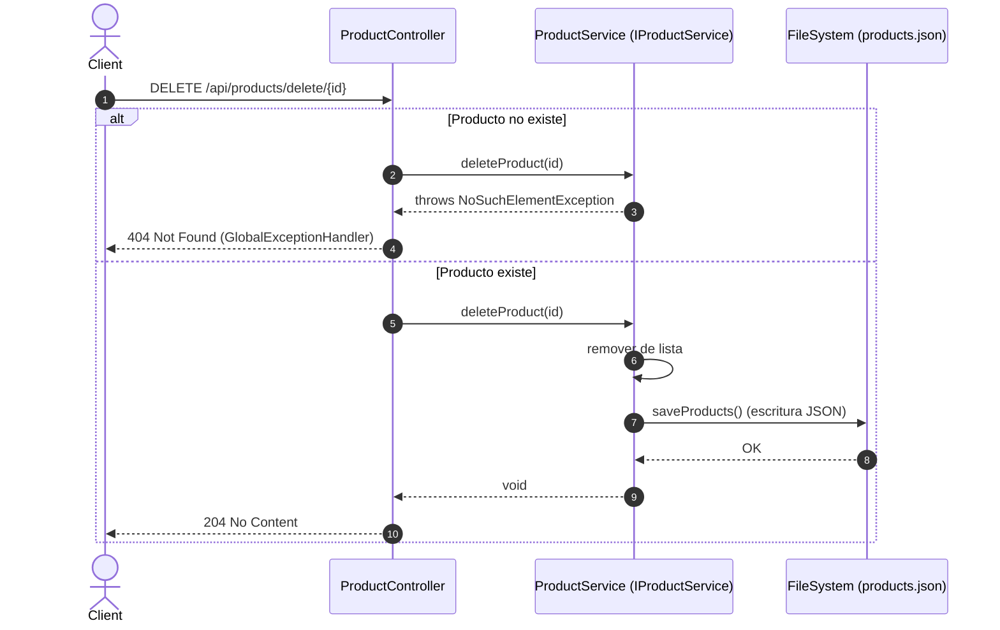

# MercadoLibre API (Demo)

## Descripción
API REST en **Spring Boot** que gestiona productos tipo MercadoLibre.  
Los datos se almacenan en el archivo `products.json` (persistencia en archivo, sin base de datos).

## Endpoints
Base: `/api/products`

- `GET /get` → Lista todos los productos.
- `GET /get/{id}` → Obtiene un producto por su ID.
- `POST /create` → Crea un producto.
- `PUT /update/{id}` → Actualiza un producto.
- `DELETE /delete/{id}` → Elimina un producto.

### Ejemplo de request (crear/actualizar)
Body JSON:

```json
{
	"name": "Teclado mecánico",
	"category": "Periféricos",
	"price": 150,
	"stock": 10,
	"description": "Switch azul"
}
```

### Ejemplos de respuesta
- 200/201 OK/CREATED → Objeto `ProductResponseDto` con el `id` asignado.
- 204 NO CONTENT → En delete.

## Validaciones
`ProductResponseDto` aplica:
- `name`: requerido (no vacío)
- `category`: requerido (no vacío)
- `price`: `>= 100` y positivo
- `stock`: `>= 1` y positivo

## Manejo de errores (GlobalExceptionHandler)
- 404 Not Found

```json
{ "codigo": 404, "mensaje": "Producto no encontrado" }
```

- 400 Bad Request (validación)

```json
{
	"codigo": 400,
	"mensaje": "Datos inválidos",
	"errores": [ { "campo": "price", "mensaje": "El precio debe ser un valor positivo" } ]
}
```

- 500 Internal Server Error

```json
{ "codigo": 500, "mensaje": "Error inesperado", "detalles": "..." }
```


## Ejemplos con curl

### Obtener todos los productos
```bash
curl http://localhost:8080/api/products/get
```

### Obtener producto por ID
```bash
curl http://localhost:8080/api/products/get/25
```

### Crear producto
```bash
curl -X POST http://localhost:8080/api/products/create \
    -H "Content-Type: application/json" \
    -d '{
        "name": "Test",
        "category": "Gamer",
        "price": 1800000,
        "stock": 35,
        "description": ""
    }'
```

### Actualizar producto
```bash
curl -X PUT http://localhost:8080/api/products/update/21 \
    -H "Content-Type: application/json" \
    -d '{
        "name": "PC gamer INTEL I9 - RTX5080 - 64GB Ram",
        "category": "Gamer",
        "price": 1900000,
        "stock": 5,
        "description": "Computador Gamer, INTEL I9 - RTX5080 - 64GB Ram especial para jugar todo lo que quieras."
    }'
```

### Eliminar producto
```bash
curl -X DELETE http://localhost:8080/api/products/delete/34
```

## Ejecución rápida
```bash
mvn spring-boot:run
```

## Notas técnicas
- Stack: Java 17, Spring Boot 3, Jackson.
- Persistencia en archivo: se escribe en `src/main/resources/products.json` en ejecución normal.
- En tests, el servicio se configura para NO escribir en el archivo (sin efectos colaterales).

## Estrategia técnica
- Se usó GenAI para acelerar generación de modelos/servicios/controladores.
- Buenas prácticas REST y manejo de errores centralizado.
- Revisa `run.md` para ejemplos de prueba con PowerShell y cómo ejecutar tests.

# Diagramas de secuencia

A continuación se describen los principales flujos de la API usando diagramas de secuencia (Mermaid).

Nota: Las validaciones con `@Valid` pueden disparar `MethodArgumentNotValidException`, gestionada por `GlobalExceptionHandler` con respuesta 400.

## 1) Obtener producto por ID (GET /api/products/get/{id})



## 2) Listar productos (GET /api/products/get)



## 3) Crear producto (POST /api/products/create)



## 4) Actualizar producto (PUT /api/products/update/{id})



## 5) Eliminar producto (DELETE /api/products/delete/{id})



## Notas de tests
- En tests, `ProductService(false)` deshabilita `saveProducts()` para no escribir en `products.json`.
- Los tests del controlador usan `@WebMvcTest` + `@MockBean(IProductService)` y validan el JSON de respuesta.
