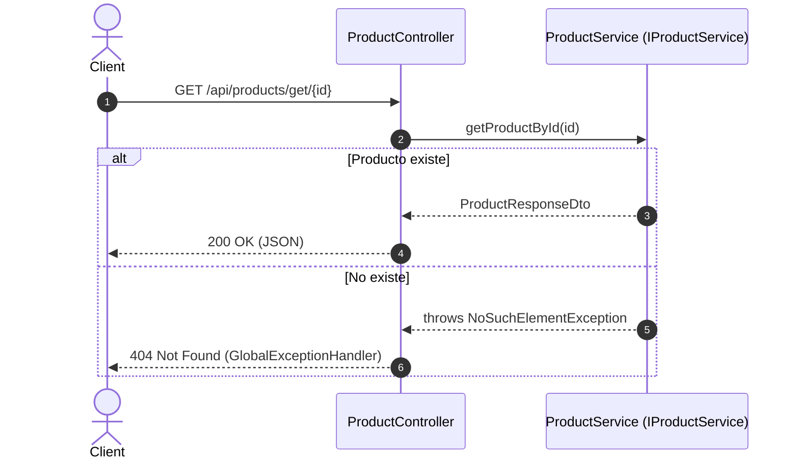
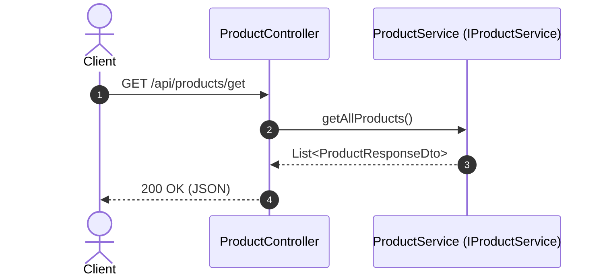
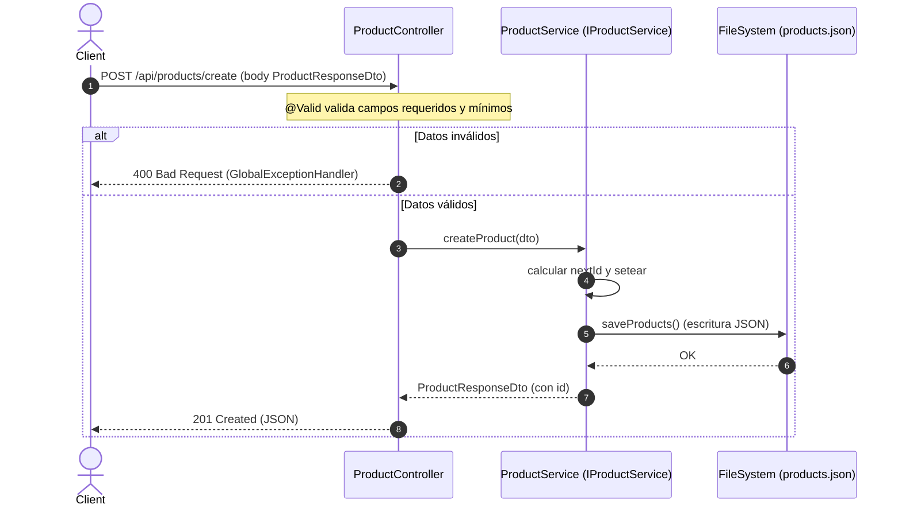
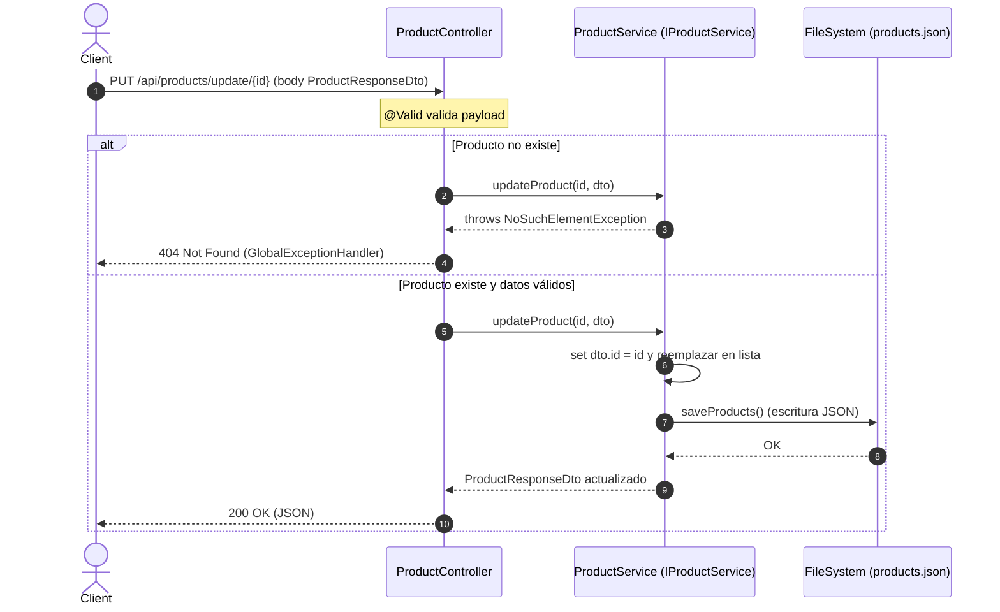
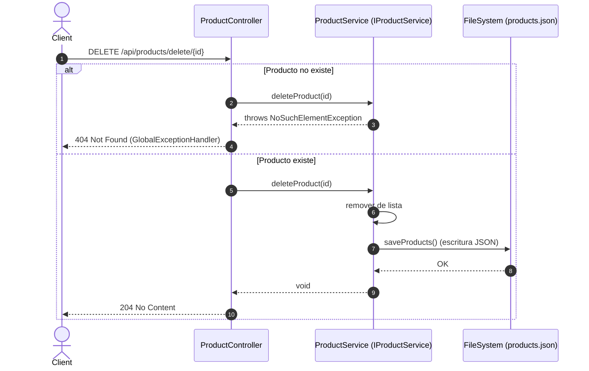

# Diagramas de secuencia

A continuación se describen los principales flujos de la API usando diagramas de secuencia (Mermaid).

Nota: Las validaciones con `@Valid` pueden disparar `MethodArgumentNotValidException`, gestionada por `GlobalExceptionHandler` con respuesta 400.

## 1) Obtener producto por ID (GET /api/products/get/{id})

## 2) Listar productos (GET /api/products/get)

## 3) Crear producto (POST /api/products/create)

## 4) Actualizar producto (PUT /api/products/update/{id})

## 5) Eliminar producto (DELETE /api/products/delete/{id})

## Notas de tests
- En tests, `ProductService(false)` deshabilita `saveProducts()` para no escribir en `products.json`.
- Los tests del controlador usan `@WebMvcTest` + `@MockBean(IProductService)` y validan el JSON de respuesta.
